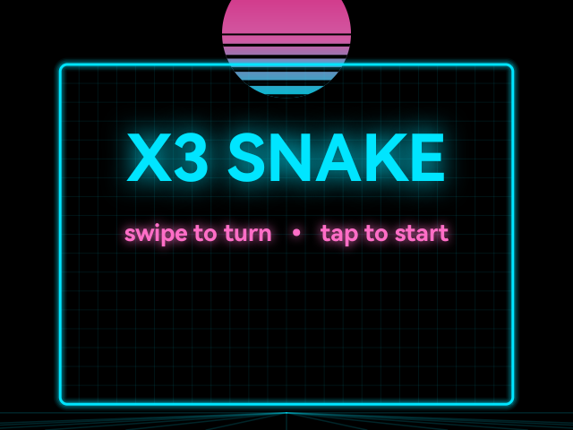
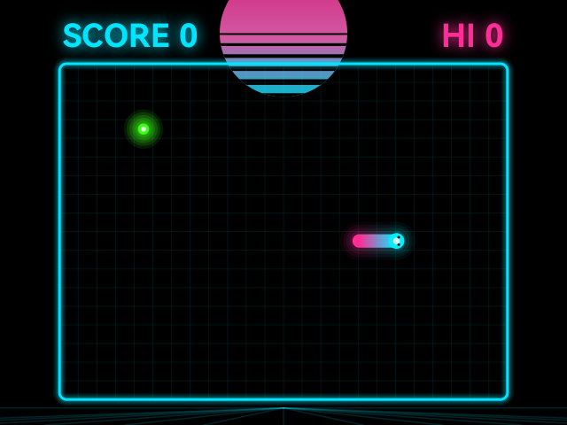

# X3 Snake

A modern, synthwave take on Snake for the RayNeo X3 Pro AR glasses — neon vector
graphics, glow, particle bursts, smooth interpolated motion, all on a pure-black
(waveguide-transparent) canvas so the game floats in the real world.

## Screenshots

<p>
  
  
</p>

Built entirely on the **proven** X3 rendering path (WanderQuest / TapInsight): a
custom Canvas `SnakeView` inside a dual-draw `BinocularSbsLayout`. **No libVLC, no
SurfaceView, no external dependencies** — just the Android SDK, so there's nothing
to time-out or crash on surface creation.

## Controls (temple trackpad)

- **Swipe** up / down / left / right on the right temple pad → turn.
- **Tap** (light touch or firm click) → start, and restart after game over.

## How it works

| Piece | File |
|---|---|
| Binocular SBS (dual-draw, live `width/2`) | `ui/BinocularSbsLayout.kt` |
| Temple trackpad → swipes/taps | `input/TrackpadGestureEngine.kt` |
| Game logic (grid, growth, collision, speed-up) | `game/SnakeGame.kt` |
| Neon particle bursts | `game/Particles.kt` |
| Rendering (sun, floor, snake glow, HUD) | `render/SnakeView.kt` |
| Density + loop + input wiring | `MainActivity.kt` |

X3 specifics baked in:
- Density set once via `attachBaseContext` + `createConfigurationContext(DENSITY_MEDIUM)`
  — never by mutating `DisplayMetrics.widthPixels` (that compounds to the "240px per
  eye" bug).
- SBS geometry from the **live** view width each frame (idempotent).
- Black canvas = transparent on the waveguide; neon glow via layered translucent
  draws (stays on the hardware-accelerated path).
- ~30 fps Choreographer loop (thermal-friendly); smooth motion comes from
  interpolating the snake between grid steps.
- Firm temple click arrives as a KEY (`BUTTON_A`) — handled first in `dispatchKeyEvent`.

## Build & install

```bash
cd /Users/me/Projects/x3snake
./gradlew :app:assembleDebug && adb install -r app/build/outputs/apk/debug/app-debug.apk && adb shell am start -n com.tropicalstream.x3snake.debug/com.tropicalstream.x3snake.MainActivity
```

## Ideas for next

- Synthwave audio loop + eat/crash SFX.
- Wrap-around walls mode; obstacles.
- Combo multiplier + screen-shake on big scores.
- Per-run high-score persistence (SharedPreferences).
